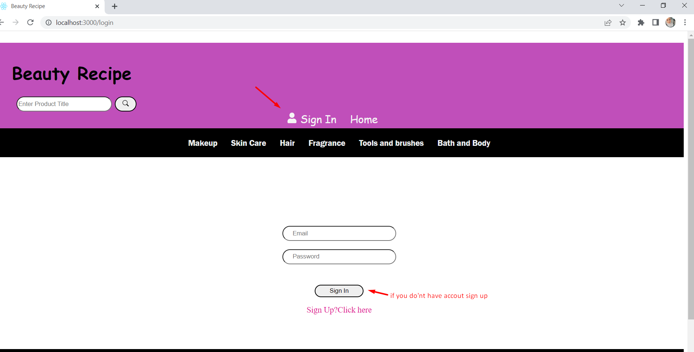
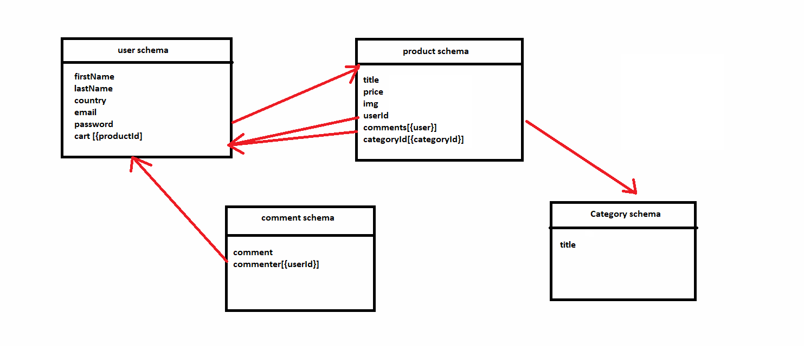

  

<h3 align="center">Beauty Recipe</h3>

---

 An online store was developed to help users to buy and sell a beauty products.
      

## 📝 Table of Contents

- [About](#about)
- [Getting Started](#getting_started)
- [Usage](#usage)
- [Built Using](#built_using)
- [User Story](#user_story)
- [Data Flow](#data_flow)
- [Guided By](#guided_by)

## 🧠About 

An online store which name is Beauty Recipe was developed to help customers to buy beauty products like makeup,skin care,hair,fragrance,bath and body & tools and brushes ,also they can sell their beauty product, i tryed to make a simple design to help the customers to use the website .

## 🏁 Getting Started 

These instructions will get you a copy of the project up and running on your local machine for development and testing purposes.

### Prerequisites

- Visual Studio Code follow this link to install
- Git Bash follow this link to install
- MongoDB follow this link to install
- Node.js follow this link to install

### Installing

1. clone the repo to your local machine using git bash.
   git clone https://github.com/C5-MarahShihadeh/MERAKI_Academy_Project_4.git

2. install packages repeat this step in backend and frontend folder
   npm i

3. Run the server using git bash inside backend folder
   npm run dev

4. Run application using git bash inside frontend folder
   npm run start

Now App ready to use

## 🈠Usage 

* you don't have to register to navigate our web app.

* you can click on the Home tab provided in the navigation bar to view the home section
  

* you can click on add to cart button to add this product to your cart but you have to be one of our users, so you should craete an account.
  if you have account =>
  
    if you dont have account=>
  
  add to cart=>
  
 view product in cart=>
  

* you can view products in cart and delete them if you want.
    

* you can click on add feedback button to add your feedback about product but you have to be one of our users.
  if you have account =>
  
    if you dont have account=>
  
add your feedback=>

* you can click on the Add your product tab provided in the navigation bar to sell your beauty products and also you can delete and update your product but you have to sign in first.
  if you have account =>
  
  if you dont have account=>
  
  click here to add your product=>
  
  add your details about your product=>
  

* you can search about products you need.
  

## ⛏️ Built Using 

- [MongoDB](https://www.mongodb.com/) - Database
- [Express JS](https://expressjs.com/) - Server Framework
- [React JS](https://https://reactjs.org/) - Web Framework
- [Node JS](https://nodejs.org/en/) - Server Environment

##  User Story 

-Link of Project 4 Trello
https://trello.com/b/krzuRRNI/project-4

##  Data Flow 

  

## ⚠️ Guided By 

This project is guided by ©️ **[MERAKI Academy](https://www.meraki-academy.org)**
